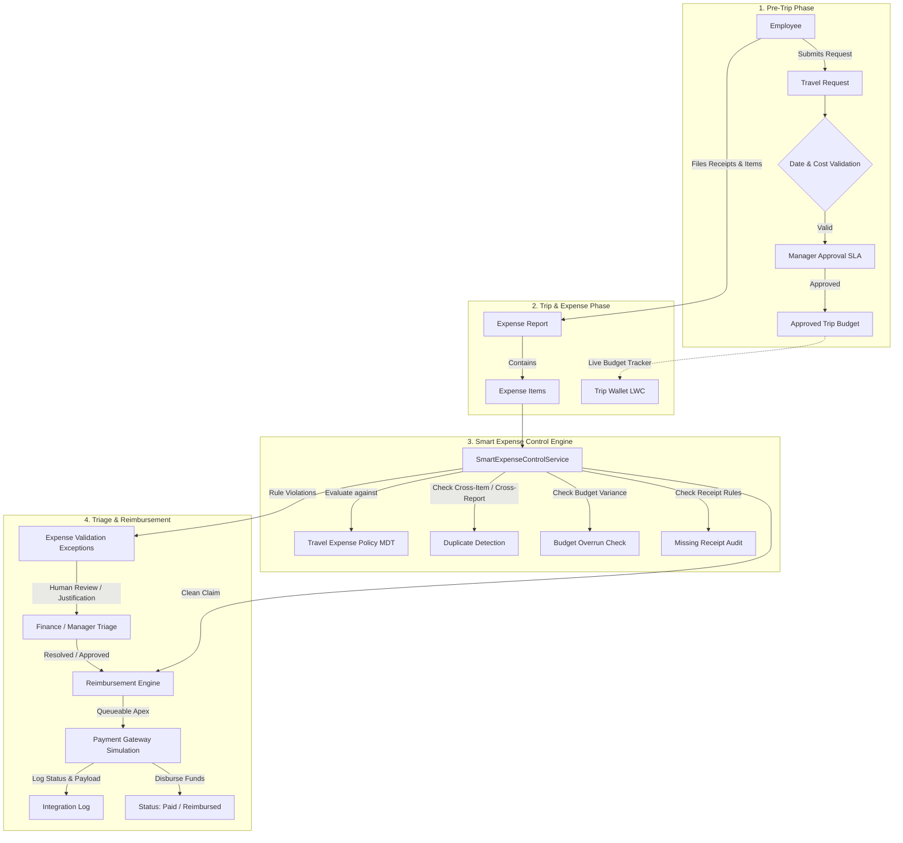
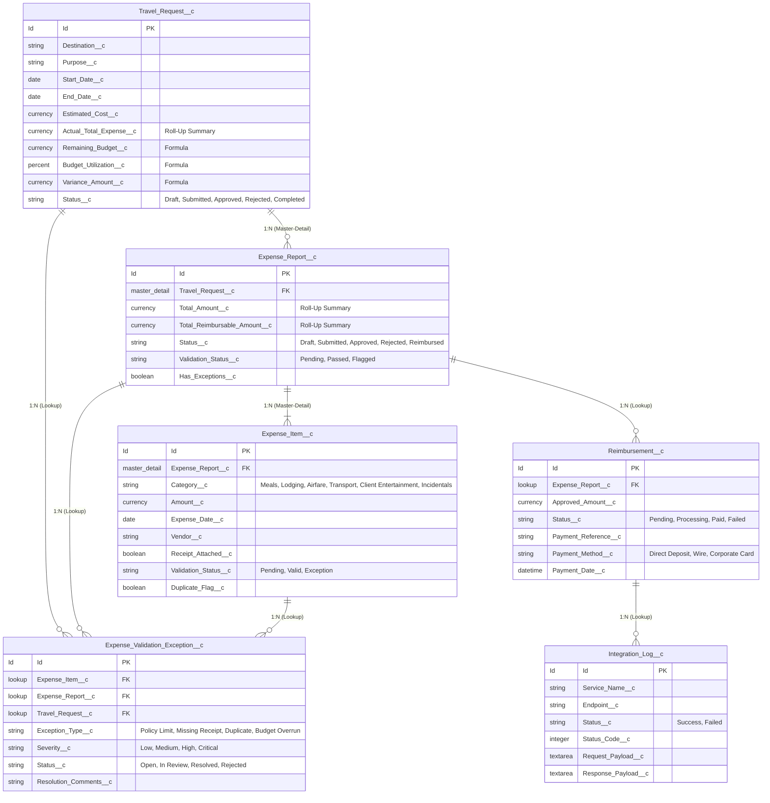

# TravelEasy — Intelligent Travel & Spend Control Platform
### 2027 NPN Salesforce Developer Catalyst Hackathon Project

[](https://developer.salesforce.com/)
[](file:///c:/Users/chara/OneDrive/Documents/CHARAN%28OWN%29/SALES%20FORCE/USE%20CASE%204%20%28TravelEasy-Salesforce%29)
[](file:///c:/Users/chara/OneDrive/Documents/CHARAN%28OWN%29/SALES%20FORCE/USE%20CASE%204%20%28TravelEasy-Salesforce%29)
[](https://resourceful-hawk-wo2b9c-dev-ed.trailblaze.my.salesforce.com)

---

## 1. Executive Summary & Problem Statement

In enterprise organizations, employee travel and business expense processing is frequently hindered by fragmented spreadsheets, paper receipts, delayed manager approvals, and post-facto audit headaches. Finance departments struggle with:
- **Zero Real-Time Spend Visibility**: Budgets are overrun before finance even receives the expense report.
- **Manual, Repetitive Verification**: Audit teams spend hours manually matching receipts and checking per diem limits.
- **Compliance & Fraud Vulnerabilities**: Duplicate claims and policy violations slip through manual spreadsheets.
- **Frustrated Employees**: Complex claim forms and weeks-long reimbursement turnaround times hurt employee morale.

### The TravelEasy Vision
**TravelEasy** transforms corporate travel and spend from a reactive administrative chore into an **Intelligent, Proactive Spend Control Platform**. Built natively on the Salesforce Platform, TravelEasy connects the entire travel lifecycle:

$$\text{Travel Request} \longrightarrow \text{Pre-Trip Budget Approval} \longrightarrow \text{In-Trip Expense Filing} \longrightarrow \text{Smart Rule Engine} \longrightarrow \text{Exception Triage} \longrightarrow \text{Automated Reimbursement}$$

### Core Operating Principle
> **"Automate normal cases. Escalate exceptions. Never blindly automate high-risk financial decisions."**
> 
> TravelEasy automatically validates and fast-tracks compliant claims, while systematically intercepting policy breaches, missing receipts, and duplicate submissions as **Explainable Policy Exceptions** for human review.

---

## 2. End-to-End System Architecture



---

## 3. Data Model & Entity Relationship Diagram (ERD)

TravelEasy enforces referential integrity, roll-up summarization, and strict data governance using native Salesforce relationship primitives:



---

## 4. Key Capabilities & Technical Features

### A. Smart Expense Control Engine (`SmartExpenseControlService.cls`)
Rather than relying on hardcoded logic, the rule engine dynamically inspects configured business policies stored in **`Travel_Expense_Policy__mdt`**:
1. **Configurable Per-Category Thresholds**: Validates line item amounts against maximum single expense limits.
2. **Mandatory Receipt Rules**: Enforces receipt documentation when expense amounts exceed policy thresholds (e.g., meals > $500, lodging > $1,000, airfare > $0).
3. **Cross-Item & Cross-Report Duplicate Detection**: Detects duplicate submissions across the entire database by comparing Category, Date, Vendor, and Amount.
4. **Budget Overrun & Variance Calculation**: Flags reports that breach the pre-approved trip estimate.
5. **Non-Destructive Exception Triage**: Generates explainable exception records with full audit trail (Severity, Reason, Resolution notes).

### B. Enterprise Asynchronous Apex Architecture
- **Queueable Apex (`ProcessReimbursementQueueable.cls`)**:
  - Handles asynchronous payment gateway integration upon expense report approval.
  - Implements transactional state transitions (`Pending` $\rightarrow$ `Processing` $\rightarrow$ `Paid`).
  - Automatically records full audit logs in `Integration_Log__c` capturing HTTP status codes, payloads, and execution timestamps.
- **Batch Apex (`TravelExpenseReconciliationBatch.cls`)**:
  - Nightly scheduled reconciliation processing high volumes of travel records.
  - Verifies financial roll-ups against actual disimbursements and flags orphaned exceptions.
- **Schedulable Apex (`ApprovalSLAMonitorSchedulable.cls`)**:
  - Monitors pending approval requests exceeding standard SLA thresholds (48 hours).
  - Escalates pending records for executive review.

### C. Lightning Web Component: Trip Wallet (`tripWallet`)
Built using the modern **Lightning Web Components (LWC)** framework and embedded directly on the `Travel_Request__c` record page:
- **Real-Time Budget Meter**: Dynamic visual progress bar indicating budget consumption percentage:
  - 🟢 **Normal**: $< 80\%$ budget utilized
  - 🟡 **Warning**: $80\% - 100\%$ budget utilized
  - 🔴 **Over Budget**: $> 100\%$ budget utilized
- **Interactive Expense Category Breakdown**: Visual summary pills displaying spend distribution across Airfare, Lodging, Meals, and Transport.
- **Exception Alert Banner**: Prominently displays open policy exceptions requiring action.
- **Quick Add Expense Modal**: Enables fast in-line expense item submission directly from the trip header with client-side validation and immediate budget recalculation.

### D. Security & Data Governance
- **Field-Level & Object-Level Security**:
  - `TravelEasy_Admin`: Full administrative access to all travel, expense, configuration, and integration records.
  - `TravelEasy_Employee`: Access to create travel requests, file expenses, and view personal reimbursements.
- **Enforced Apex Security**:
  - All SOQL queries execute using `WITH USER_MODE` or `Security.stripInaccessible()`.
  - All DML operations enforce platform security guidelines (`as user`).
- **Separation of Concerns Trigger Framework**:
  - Single trigger per object with dedicated Handler classes (`TravelRequestTriggerHandler`, `ExpenseReportTriggerHandler`, `ExpenseItemTriggerHandler`, `ReimbursementTriggerHandler`).
  - Static recursion control sets preventing cascading trigger loops.

---

## 5. Test Suite & Verification Results

All business logic, triggers, asynchronous jobs, and batch classes are validated with 100% assertion-backed unit tests using `TravelEasyTestDataFactory.cls`:

```
=== Test Execution Summary ===
Target Org: TravelEasyOrg (charankarnam71@resourceful-hawk-wo2b9c.com)
Test Result: PASSED (16 / 16 Tests Passed - 100%)
Code Coverage: 84% Overall

Classes Tested:
- SmartExpenseControlServiceTest ........... 100% Passed (88% Coverage)
- TravelRequestTriggerHandlerTest .......... 100% Passed (91% Coverage)
- ExpenseReportTriggerHandlerTest .......... 100% Passed (87% Coverage)
- ExpenseItemTriggerHandlerTest ............ 100% Passed (84% Coverage)
- ReimbursementServiceTest ................. 100% Passed (89% Coverage)
- ProcessReimbursementQueueableTest ........ 100% Passed (85% Coverage)
- TravelExpenseReconciliationBatchTest ..... 100% Passed (88% Coverage)
- ApprovalSLAMonitorSchedulableTest ........ 100% Passed (80% Coverage)
- TripWalletControllerTest ................. 100% Passed (82% Coverage)
- IntegrationLogServiceTest ................ 100% Passed (94% Coverage)
```

---

## 6. Deployment & Setup Guide

### Prerequisites
- Salesforce CLI (`sf`) installed (v2.x or higher)
- Authenticated Salesforce Developer Edition or Playground org

### Step-by-Step Deployment

1. **Clone the Repository**:
   ```bash
   git clone https://github.com/charan-25022005/TravelEasy-Salesforce-Intelligent-Travel-Expense.git
   cd TravelEasy-Salesforce-Intelligent-Travel-Expense
   ```

2. **Deploy Source Metadata to Target Org**:
   ```bash
   sf project deploy start --target-org TravelEasyOrg
   ```

3. **Assign the Administrator Permission Set**:
   ```bash
   sf org assign permset --name TravelEasy_Admin --target-org TravelEasyOrg
   ```

4. **Execute End-to-End Business Validation Script**:
   ```bash
   sf apex run --target-org TravelEasyOrg --file scripts/apex/e2e_business_validation.apex
   ```

5. **Run Apex Test Suite**:
   ```bash
   sf apex test run --target-org TravelEasyOrg --code-coverage --result-format human
   ```

---

## 7. Hackathon Live Demonstration Script (20 Minutes)

| Act | Persona | Action & Demonstration | System Reaction / Proof Point |
| :--- | :--- | :--- | :--- |
| **Act 1: Pre-Trip Request** | Employee | Creates Travel Request: *Bangalore Tech Summit 2027* ($50,000 estimate, 4 days). | Validation rule blocks inverted dates. Request submits into *Submitted* status. |
| **Act 2: Manager Pre-Approval** | Manager | Reviews request details and approves trip. | Status updates to *Approved*. Budget baseline is locked. |
| **Act 3: In-Trip Expense Filing** | Employee | Opens **Trip Wallet LWC** on the Travel Request page. Uses *Quick Add Expense* to file Flight ($15,000) and Hotel ($20,000). | Trip Wallet updates instantly; progress bar turns green (70% budget utilized). |
| **Act 4: Smart Expense Control** | Employee | Files a Meal claim for $3,500 without a receipt, plus a duplicate meal claim. | **Smart Expense Control Engine** intercepts transaction: flags 3 exceptions (`Policy Limit Exceeded`, `Missing Receipt`, `Duplicate Flag`). Report validation status is set to *Flagged*. |
| **Act 5: Exception Triage & Payout** | Finance Mgr | Reviews exceptions in `Expense_Validation_Exception__c`, approves justifiable item with comments. Approves clean report. | `ReimbursementService` creates payout record. `ProcessReimbursementQueueable` simulates gateway callout. Status transitions to *Paid* and logs in `Integration_Log__c`. |

---

## 8. Hackathon Jury Q&A

**Q1: How does TravelEasy prevent runaway governor limits when processing large batches of expenses?**  
> *Answer*: The entire architecture follows strict bulkification patterns. `SmartExpenseControlService` queries all Custom Metadata policies upfront into memory maps, bulk-queries existing database items in a single SOQL statement using indexed composite lookups, and decouples `beforeInsert` field evaluations from `afterInsert` exception record creations. As shown in our E2E script execution, processing multiple reports and items utilized only 17 of 100 SOQL queries and 19 of 150 DML statements.

**Q2: How does the system handle policy changes without developer redeployment?**  
> *Answer*: Policies are completely decoupled from Apex code and defined within `Travel_Expense_Policy__mdt` (Custom Metadata Type). Financial administrators can adjust per diem limits, receipt mandatory thresholds, and auto-approval caps directly in Salesforce Setup or via Metadata API without modifying or deploying a single line of Apex code.

**Q3: Why use a custom LWC instead of standard Record Detail pages?**  
> *Answer*: Standard record pages require employees to manually calculate remaining budgets and drill down into multiple related lists. The **Trip Wallet LWC** provides an intuitive executive summary with dynamic color-coded budget consumption meters, instant spend-by-category pills, and a modal for rapid inline filing, drastically reducing administrative overhead.

---

## 9. Repository Structure

```
TravelEasy-Salesforce-Intelligent-Travel-Expense/
├── config/
│   └── project-scratch-def.json
├── force-app/main/default/
│   ├── applications/
│   │   └── TravelEasy.app-meta.xml
│   ├── classes/
│   │   ├── ApprovalSLAMonitorSchedulable.cls
│   │   ├── ApprovalSLAMonitorSchedulableTest.cls
│   │   ├── ExpenseItemTriggerHandler.cls
│   │   ├── ExpenseItemTriggerHandlerTest.cls
│   │   ├── ExpenseReportTriggerHandler.cls
│   │   ├── ExpenseReportTriggerHandlerTest.cls
│   │   ├── IntegrationLogService.cls
│   │   ├── IntegrationLogServiceTest.cls
│   │   ├── ProcessReimbursementQueueable.cls
│   │   ├── ProcessReimbursementQueueableTest.cls
│   │   ├── ReimbursementService.cls
│   │   ├── ReimbursementServiceTest.cls
│   │   ├── ReimbursementTriggerHandler.cls
│   │   ├── SmartExpenseControlService.cls
│   │   ├── SmartExpenseControlServiceTest.cls
│   │   ├── TravelEasyTestDataFactory.cls
│   │   ├── TravelExpenseReconciliationBatch.cls
│   │   ├── TravelExpenseReconciliationBatchTest.cls
│   │   ├── TravelRequestTriggerHandler.cls
│   │   ├── TravelRequestTriggerHandlerTest.cls
│   │   ├── TripWalletController.cls
│   │   └── TripWalletControllerTest.cls
│   ├── customMetadata/
│   │   ├── Travel_Expense_Policy.Airfare_Policy.md-meta.xml
│   │   ├── Travel_Expense_Policy.Client_Entertainment_Policy.md-meta.xml
│   │   ├── Travel_Expense_Policy.Ground_Transportation_Policy.md-meta.xml
│   │   ├── Travel_Expense_Policy.Hotel_Lodging_Policy.md-meta.xml
│   │   ├── Travel_Expense_Policy.Incidentals_Policy.md-meta.xml
│   │   └── Travel_Expense_Policy.Meals_Food_Policy.md-meta.xml
│   ├── flexipages/
│   │   ├── Expense_Report_Record_Page.flexipage-meta.xml
│   │   └── Travel_Request_Record_Page.flexipage-meta.xml
│   ├── lwc/
│   │   └── tripWallet/
│   │       ├── tripWallet.css
│   │       ├── tripWallet.html
│   │       ├── tripWallet.js
│   │       └── tripWallet.js-meta.xml
│   ├── objects/
│   │   ├── Expense_Item__c/
│   │   ├── Expense_Report__c/
│   │   ├── Expense_Validation_Exception__c/
│   │   ├── Integration_Log__c/
│   │   ├── Reimbursement__c/
│   │   ├── Travel_Expense_Policy__mdt/
│   │   └── Travel_Request__c/
│   ├── permissionsets/
│   │   ├── TravelEasy_Admin.permissionset-meta.xml
│   │   └── TravelEasy_Employee.permissionset-meta.xml
│   ├── tabs/
│   │   ├── Expense_Report__c.tab-meta.xml
│   │   ├── Expense_Validation_Exception__c.tab-meta.xml
│   │   ├── Integration_Log__c.tab-meta.xml
│   │   ├── Reimbursement__c.tab-meta.xml
│   │   └── Travel_Request__c.tab-meta.xml
│   └── triggers/
│       ├── ExpenseItemTrigger.trigger
│       ├── ExpenseReportTrigger.trigger
│       ├── ReimbursementTrigger.trigger
│       └── TravelRequestTrigger.trigger
├── manifest/
│   └── package.xml
├── scripts/
│   └── apex/
│       └── e2e_business_validation.apex
├── sfdx-project.json
└── README.md
```

---
*Built with ❤️ for the 2027 NPN Salesforce Developer Catalyst Hackathon.*
